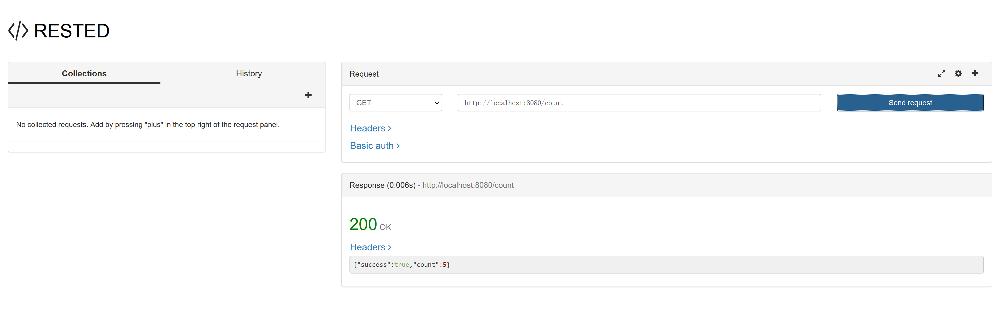
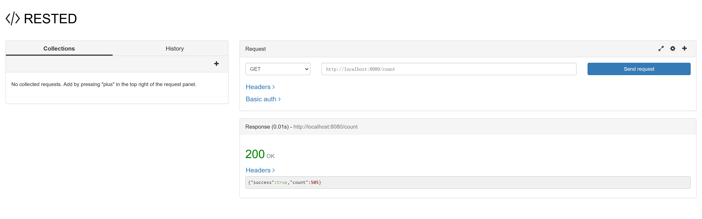
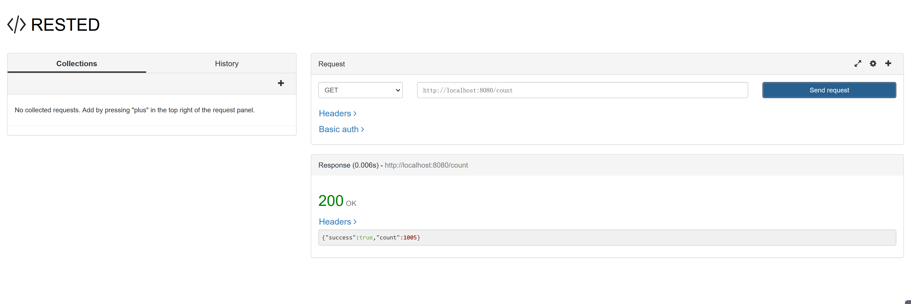
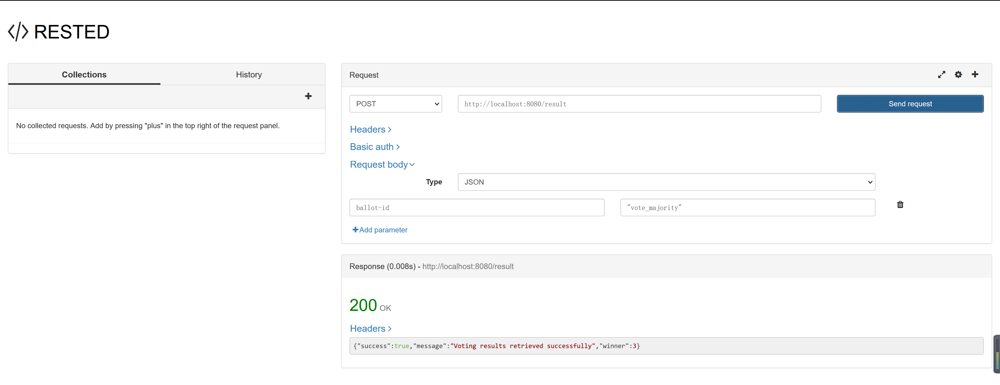
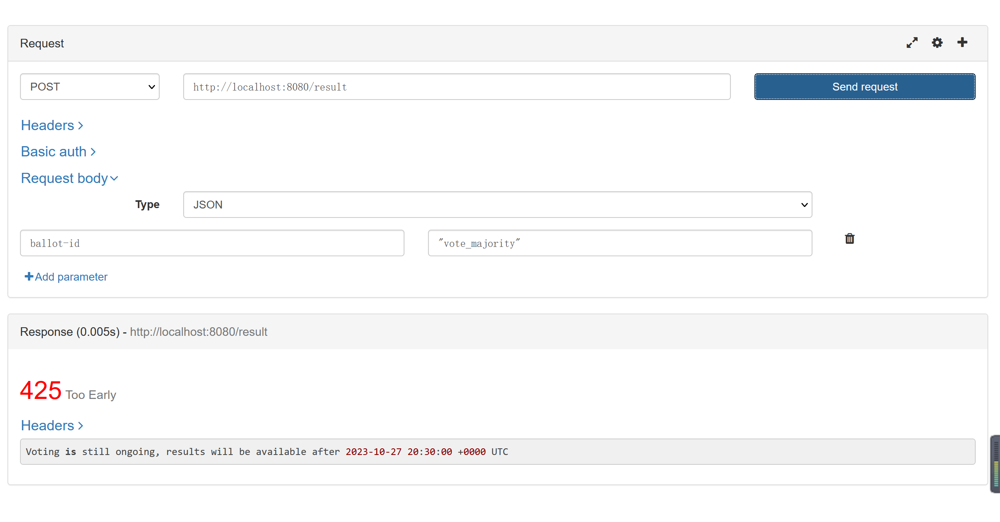

# Testing `launch-all-rest-agents.exe`

## `/count`

### Beginning... (5 ballots created)

### Continue ... (100 agents voted for 5 ballots)

### End (100 agents requested results of 5 ballots)

## `/results`

### majority

### borda

### copeland

### approval

# Testing only Server

(Testing only `launch-rsagt.exe`)

## new_ballot

## early result request

